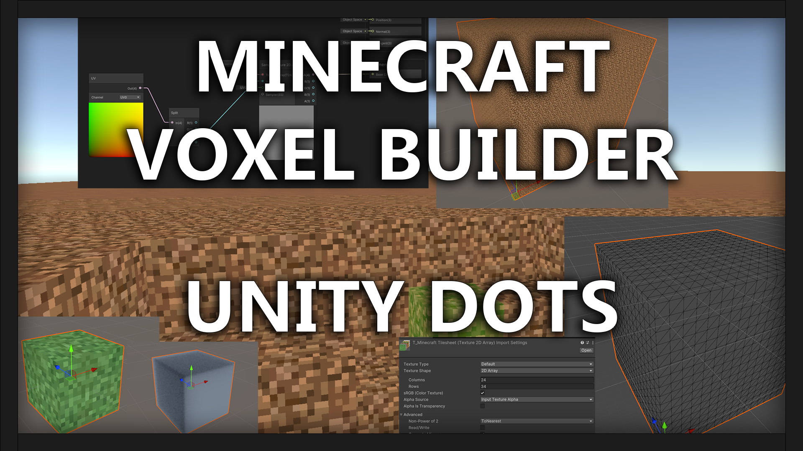

# Unity-Voxel-Engine-Tutorial

In this tutorial we will be building a voxel Minecraft-like builder using Unity DOTS, jobs, and burst. We will start from scratch and work our way up to building basic cubes with vertex data, designing shaders, writing highly performant burst compiled code, multithreaded jobs, and creating an entire voxel world that we can walk around in!

This tutorial is aimed at more advance users who are comfortable in the engine and are new to DOTS.

Tutorial: https://www.linkedin.com/pulse/minecraft-voxel-builder-unity-dots-jason-skillman--cmere/
